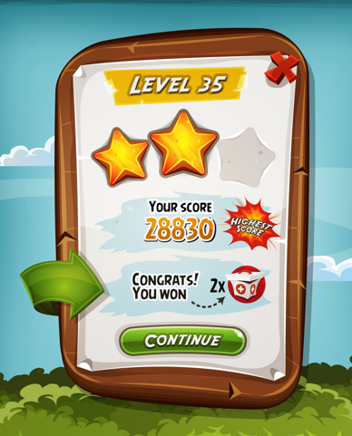
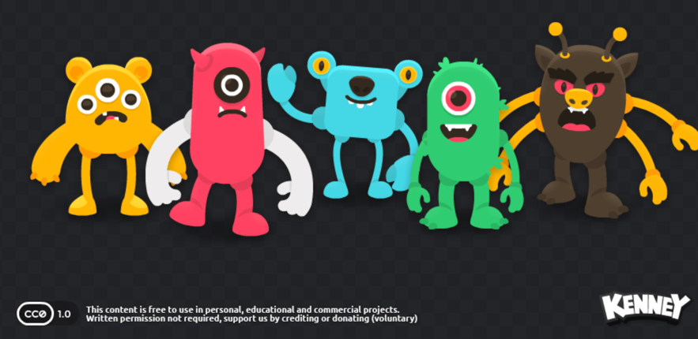


# TechArt Home Assignment

## Assignment Need to know
● You have 2 days to submit you work

● The assignment should take 4 - 8 hours of work

> Questions to: shahar@vi.co
## Set Up Project

● Download unity 2022.3.x lts

● Fork this repository to your github account

● Open the project in Unity 2022.3.x

● You Can use any resources, scripts, plugins, assets you want

● Instead of Kenney.nl assets that are in the game, feel free to use other if wanted

● You can learn and use any tools available to you such as

    ○ Google
    ○ Forums
    ○ Facebook
    ○ ChatGPT
    ○ And more

> Questions to: shahar@vi.co

## What & how we test?

● We are checking your **Unity General Knowledge** 

● We evaluate how **Organized** you are

● **Looking good** art is very important to us

● Smooth and **Polished** animations is a must

● **VFX** and **Tweens** are a big plus

● We want to see how you build your **prefabs** & **UI**

● Take into consideration **Performance** and **Optimization**

## Tasks - Generic Service for any game

● Open the project in unity

● You can find under `Assets/RawAssets` a folder with some assets you can use

● Create and save a new scene per task under `Assets/Scenes`

 ### UI Task
   1. [ ] You need to create using UI elements a simple Win Screen
   2. [ ] Make sure to add sprites to spritesheet and use them in the UI
   3. can use - https://www.codeandweb.com/texturepacker
   4. [ ] Build the prefab using the UI from the spritesheet
   5. [ ] Add juicy animations/vfx to the UI for Open / Close / Collect
   6. [ ] _Remember to use 9 Slice for the UI elements_ 

 ### Animation Task
   1. [ ] Create a simple animation for a character (Choose any character you want from the assets folder) or Build a monster
   2. [ ] Add bones to the character using Unity 2d animation package or Spine
   3. [ ] Animate the character with a simple yet smooth animation for idle

**● Commit all changes to your fork and send us the link**

## Useful Links and Resources

● [Unity 2D Animation](https://www.youtube.com/watch?v=eXIuizGzY2A)

● [9 Slice](https://www.youtube.com/watch?v=ga9iZ-BMgjY)

● [Texture Packer](https://www.codeandweb.com/texturepacker)

● [Unity UI](https://www.youtube.com/watch?v=HwdweCX5aMI)

> Questions to: shahar@vi.co